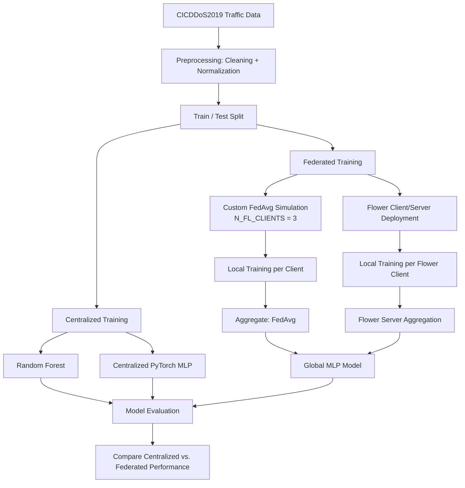

# Federated DDoS Detection

A DDoS traffic classification pipeline built around [federated learning](https://en.wikipedia.org/wiki/Federated_learning) — training a shared detection model across multiple clients without any client sending its raw network traffic to a central server.

## The problem this solves

Centralized DDoS detection has an uncomfortable dependency: it needs raw traffic data from every network it protects, which is often sensitive, siloed, or simply too large to move. Federated learning flips that — each client trains locally on its own traffic, and only model updates (not data) are shared and aggregated into a global model. This project implements that pattern against the [CICDDoS2019](https://www.unb.ca/cic/datasets/ddos-2019.html) dataset, alongside centralized baselines to compare against.

## Approach

Two models are trained and compared on the same task:

- **Random Forest** — a centralized baseline, evaluated directly against the full dataset
- **PyTorch MLP** — trained both centrally *and* federated, using [FedAvg](https://arxiv.org/abs/1602.05629) to aggregate client updates into a shared global model each round

This side-by-side setup makes it possible to directly measure the cost (or lack thereof) of moving from centralized to federated training — the core empirical question in federated learning research.

## Workflow



The pipeline branches early into centralized and federated paths so both can be benchmarked against the same preprocessed data and evaluation step — the federated side itself has two implementations (the custom FedAvg loop and the Flower deployment), both converging on a shared global MLP.

## Federated Setup

The repo implements federated training two ways:

1. **A custom FedAvg simulation** — clients are simulated in-process, with the dataset randomly partitioned across them and a global MLP aggregated after each round.
2. **A [Flower](https://flower.ai/)-based client/server setup** — a more production-representative FL deployment, with a real server process coordinating rounds against separate client processes.

Having both gives a lightweight path for fast local experimentation (the custom loop) and a more realistic FL deployment pattern (Flower) in the same codebase.

## Project Structure

```
ddos_fl_system/
├── train.py                    # Centralized + custom FedAvg training pipeline
├── evaluate.py                 # Evaluation entry point (in progress)
├── federated/
│   ├── server.py               # Flower FL server
│   └── client.py                # Flower FL client
├── run_fl.sh                   # Launches the Flower server/client setup
├── run_fl_with_logs.sh         # Same, with logging enabled
├── server.log                  # Sample Flower server run log
└── requirements.txt
```

## Tech Stack


## Why it's built this way

- **Two FL implementations, not one** — the custom in-process simulation is fast to iterate on for experiment design (partitioning strategy, round count, client count), while the Flower setup validates the same approach against a real client/server architecture closer to how FL would actually be deployed.
- **Random Forest as a baseline, not just a comparison point** — keeping a strong classical baseline in the pipeline makes it possible to sanity-check whether the added complexity of federation and deep learning is actually earning its keep on this dataset.
- **[SHAP](https://shap.readthedocs.io/) included as a dependency** — the intent is for model decisions to be explainable rather than a black box, particularly relevant for a security context where an analyst needs to trust *why* traffic was flagged.

## Current State

This is an actively evolving research/engineering pipeline, not a finished product:

- Centralized training (Random Forest + MLP) and both FL paths (custom FedAvg + Flower) are functional.
- `evaluate.py` is a work in progress.
- Some paths and shell scripts are currently pinned to a local environment and would need generalizing for portability.
- An explainability layer (SHAP) is a listed dependency but not yet wired into the training/evaluation flow.


